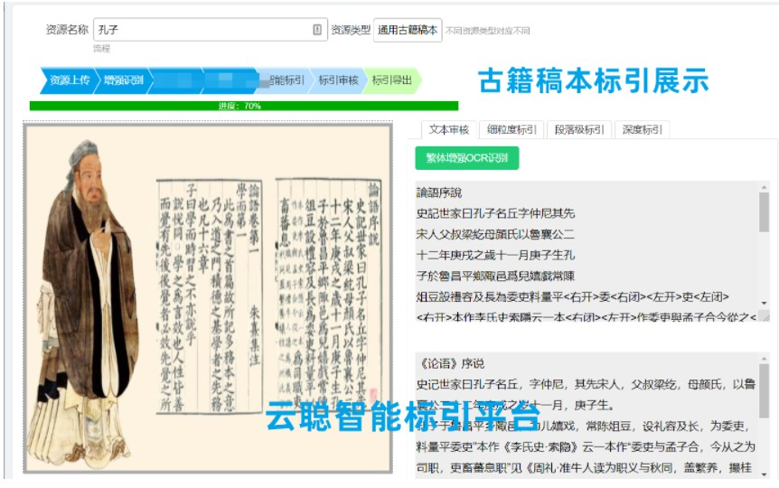
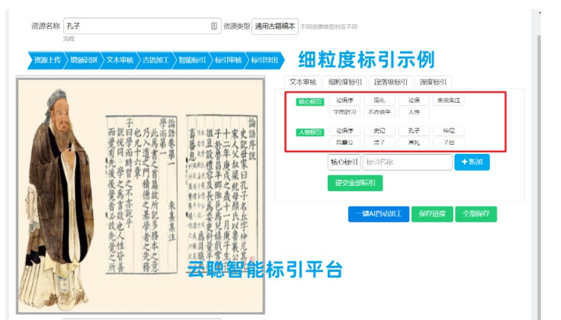

# yunconglabel
# 云聪智能标引平台

欢迎咨询：

王经理 133-5688-1864（微信同号）
叶经理 133-5688-3552 （微信同号）

云聪智能依托哈工大、中科院博士团队十余年在人工智能方面的积累和人才优势，深耕文化服务行业，构造了高质量文化知识图谱系统，研发了深挖文化关联和文化核心认知等核心技术，拥有完全自主知识产权，为企业、政府、文化部分打造具有推理能力的新一代文化认知引擎，用AI赋能文化传播创新。

使命和愿景
我们的使命:人工智能推动文化传播
我们的愿景:做全球智能的文化挖掘引擎

团队核心成员
青岛云聪智能科技有限公司总部位于青岛，AI核心成员均有欧美留学或出国工作经历。成立于2021年。

### 丛教授 首席科学顾问
工学博士，研究兴趣主要为开发和利用人工智能算法解决公共健康和医疗问题。近年来，围绕着阿尔兹海默症（AD）等复杂退行性认知疾病，通过医学图像分析、影像-基因关联分析、脑联通与脑网络分析等方面的研究，探究重大脑疾病的深层致病机理，以及对脑结构的特异性影响。相关成果已发表在Neurobiology of Aging, Brain Imaging and Behavior, Bioinformatics, Alzheimer's & Dementia 等期刊上。

### 姚教授 首席科学顾问
理学博士，智能科学与工程学院副教授。研究领域：大数据挖掘、机器学习、深度学习等在脑认知与脑疾病领域的应用；生物医学中的脑网络科学、生物医学信息学、生物信息学和健康科学。

联系邮箱：service@yuncong-ai.com
